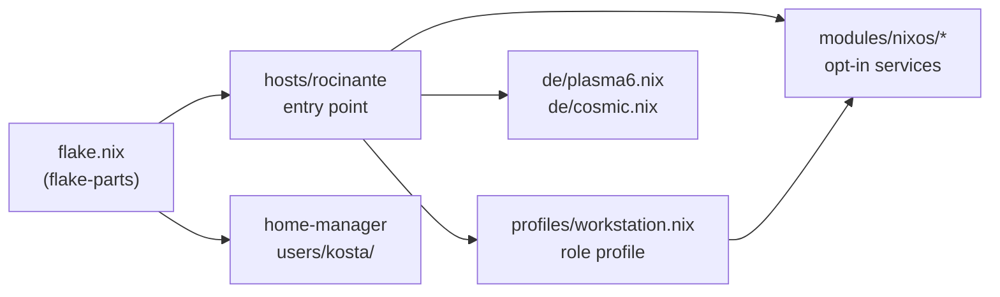
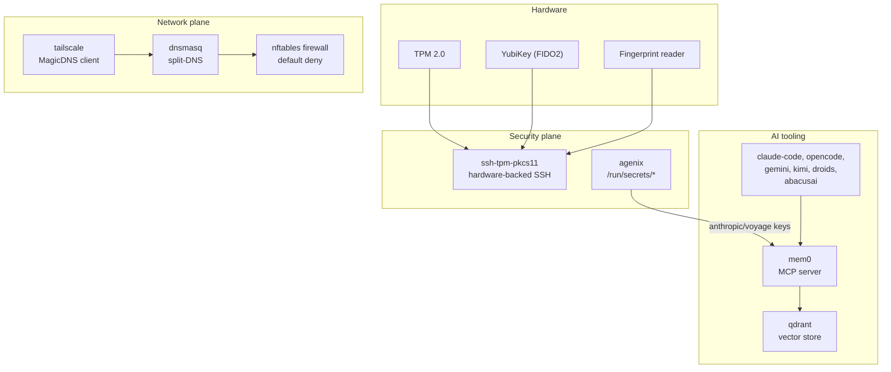

# Architecture

A single-host NixOS flake built with [flake-parts][fp], composed from small,
opt-in modules. Everything below boots and reconciles from
`nixos-rebuild switch --flake .#rocinante`.

## Composition



- **`flake.nix`** wires inputs (`nixpkgs`, `home-manager`, `disko`, `agenix`,
  `nixos-hardware`, vendor flakes) and exposes
  `nixosConfigurations.rocinante` plus `checks` for CI.
- **`hosts/rocinante/`** is the host entry point: hardware, disko, boot,
  locale, and the short list of modules this host turns on.
- **`profiles/workstation.nix`** bundles the "daily driver" role — editors,
  AI CLIs, desktop utilities — separated from host-specific concerns so a
  future host can reuse it.
- **`modules/nixos/*`** each expose `options.*.enable` (or similar) with
  sensible defaults. The host flips on what it needs; nothing leaks in by
  import order.
- **`users/kosta/`** is home-manager, imported through the
  `home-manager.nixosModules.home-manager` wrapper so system and user state
  are built atomically.

## Runtime picture



## Key design choices

- **`mkEnableOption` everywhere it matters.** Each service-shaped module
  (`mem0`, `tailscale-mesh`, `ssh-tpm`, `yubikey`, `mem0`, AI CLIs) has an
  explicit enable toggle. The host file reads as a policy statement, not a
  config dump.
- **Secrets live in `secrets/*.age`** (agenix). The encrypted files are
  checked in; plaintext lives only in `/run/secrets/` at runtime. See
  [`SECRETS.md`](./SECRETS.md).
- **Split DNS without a custom resolver.** `tailscale-mesh` wires dnsmasq so
  `*.ts.net` and private tailnet domains resolve through MagicDNS while the
  rest goes to 1.1.1.1. No systemd-resolved tug-of-war.
- **Standalone packaging flakes in `flakes/`** for tools not in nixpkgs
  (Abacus.AI, Antigravity, Claude Code, Droids, Vibe Kanban). Independent
  `flake.lock`s let them update without churning the main flake.
- **Treefmt + CI.** `nix flake check` runs `nixfmt`, `deadnix`, and `statix`
  via `treefmt-nix`. CI (`.github/workflows/test.yml`) builds the host and
  verifies formatting on every PR.

## Deploying

```sh
# Dry run
nix build .#checks.x86_64-linux.rocinante-toplevel

# Apply
sudo nixos-rebuild switch --flake .#rocinante
```

[fp]: https://flake.parts
