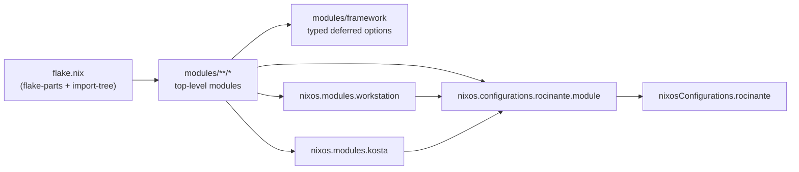

# Architecture

This is a single-host NixOS flake built with [flake-parts][fp] and the
[dendritic pattern][dendritic]. `flake.nix` recursively imports `modules/` with
`import-tree`; every active Nix file in that tree is therefore a flake-parts
top-level module rather than a conventional NixOS module.

## Composition


```mermaid
flowchart LR
  flake["flake.nix<br/>(flake-parts + import-tree)"]
  tree["modules/**/*<br/>top-level modules"]
  framework["modules/framework<br/>typed deferred options"]
  workstation["nixos.modules.workstation"]
  user["nixos.modules.kosta"]
  host["nixos.configurations.rocinante.module"]
  nixos["nixosConfigurations.rocinante"]

  flake --> tree
  tree --> framework
  tree --> workstation
  tree --> user
  tree --> host
  workstation --> host
  user --> host
  host --> nixos
```

The typed framework exposes `nixos.modules` as lazy deferred modules and
`nixos.configurations` as typed host records. Feature files merge lower-level
NixOS fragments into the broad `workstation` module. User files merge into the
broad `kosta` module, preserving `users.users.kosta.packages` scoping. Host
files merge machine policy directly into the rocinante module.

Features capture required flake inputs in their top-level module functions.
The lower-level NixOS evaluation does not receive a global `inputs` argument.

The host composition imports only:

- `nixos.modules.workstation`
- `nixos.modules.kosta`
- the disko and agenix upstream modules
- `_hardware-configuration.nix` and `_disko-config.nix`

The underscore-prefixed files are deliberately excluded from recursive
auto-import because they are lower-level generated/machine data. There is no
central feature import list.

## Module Tree

```text
modules/
├── framework/       # typed options, host export, treefmt, checks
├── hosts/rocinante/ # composition and host-specific policy
├── users/kosta/     # user-scoped packages, configuration, and migrations
├── desktop/         # Plasma, COSMIC, clipboard, desktop packages
├── hardware/        # kernel, fingerprint, YubiKey
├── networking/      # Tailscale and split DNS
├── programs/        # AI tools, nix-ld, Spotify, workstation toggles
├── services/        # audio, printing, power, optional Qdrant
└── security/        # agenix declarations and TPM-backed SSH
```

Package functions in `packages/`, standalone flakes in `flakes/`, overlays in
`overlays/`, and the recipient expression in `secrets.nix` remain outside the
auto-import tree. Encrypted secret payloads remain in `secrets/*.age` and are
decrypted only into `/run/secrets` at activation.

The optional legacy Qdrant fragment remains inert as the excluded
`_qdrant.nix` file. The rocinante host enables the workstation tools and
services it currently uses, including PipeWire with 32-bit ALSA support,
Tailscale, TeamViewer, and direnv with nix-direnv. Both the Mem0 wrapper and
persistent Mem0 service are disabled.

The single broad `workstation` module matches the current one-host topology. If
a server or other non-workstation host is added, introduce a broad `base`
module for shared features such as networking instead of creating one deferred
module per feature.

## Deploying

```sh
nix flake check --no-build --show-trace
nix build .#checks.x86_64-linux.rocinante-toplevel
sudo nixos-rebuild switch --flake .#rocinante
```

[fp]: https://flake.parts
[dendritic]: https://github.com/mightyiam/dendritic
