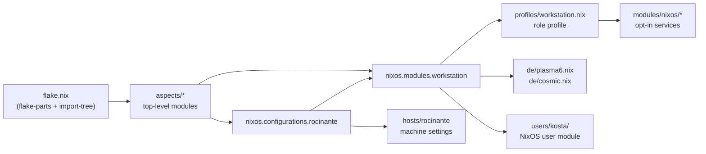
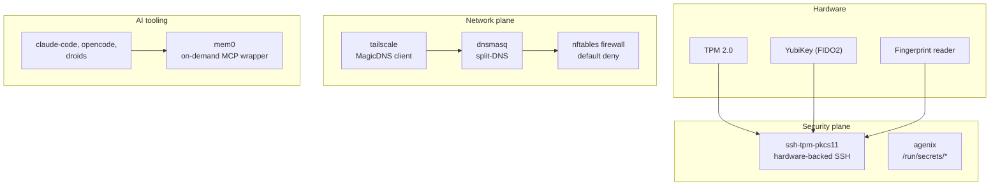

# Architecture

A single-host NixOS flake built with [flake-parts][fp] and organized using the
[dendritic pattern][dendritic]. Auto-imported top-level aspects declare typed,
deferred NixOS modules and compose the `rocinante` host. Everything below boots
and reconciles from `nixos-rebuild switch --flake .#rocinante`.

## Composition


```mermaid
flowchart LR
  flake["flake.nix<br/>(flake-parts + import-tree)"]
  aspects["aspects/*<br/>top-level modules"]
  host["nixos.configurations.rocinante"]
  workstation["nixos.modules.workstation"]
  machine["hosts/rocinante<br/>machine settings"]
  prof["profiles/workstation.nix<br/>role profile"]
  de["de/plasma6.nix<br/>de/cosmic.nix"]
  mods["modules/nixos/*<br/>opt-in services"]
  user["users/kosta/<br/>NixOS user module"]

  flake --> aspects
  aspects --> host
  aspects --> workstation
  host --> workstation
  host --> machine
  workstation --> prof
  workstation --> de
  workstation --> user
  prof --> mods
```

- **`flake.nix`** declares inputs and delegates all output construction to the
  recursively imported flake-parts modules in `aspects/`.
- **`aspects/nixos.nix`** declares the typed `nixos.modules` and
  `nixos.configurations` deferred-module options, then exports evaluated hosts
  through `flake.nixosConfigurations`.
- **`aspects/workstation.nix`** defines the reusable lower-level workstation
  module. **`aspects/rocinante.nix`** composes it with machine-specific modules,
  disko, and agenix. **`aspects/tooling.nix`** owns systems, checks, and treefmt.
- **`hosts/rocinante/`** contains hardware, disko, boot, locale, and host policy.
- **`profiles/workstation.nix`** bundles the "daily driver" role — editors,
  AI CLIs, desktop utilities — separated from host-specific concerns so a
  future host can reuse it.
- **`modules/nixos/*`** each expose `options.*.enable` (or similar) with
  sensible defaults. The host flips on what it needs; nothing leaks in by
  import order.
- **`users/kosta/`** is a NixOS module. Application packages use
  `users.users.kosta.packages`, while NixOS `programs.*` defaults remain global.
  Home Manager is not part of this flake.

## Runtime picture


```mermaid
flowchart TB
  subgraph hw["Hardware"]
    tpm["TPM 2.0"]
    yk["YubiKey (FIDO2)"]
    fp["Fingerprint reader"]
  end

  subgraph sec["Security plane"]
    sshtpm["ssh-tpm-pkcs11<br/>hardware-backed SSH"]
    agenix["agenix<br/>/run/secrets/*"]
  end

  subgraph net["Network plane"]
    ts["tailscale<br/>MagicDNS client"]
    dnsmasq["dnsmasq<br/>split-DNS"]
    fw["nftables firewall<br/>default deny"]
  end

  subgraph ai["AI tooling"]
    cli["claude-code, opencode,<br/>droids"]
    mem0["mem0<br/>on-demand MCP wrapper"]
  end

  tpm --> sshtpm
  yk --> sshtpm
  fp --> sshtpm
  cli --> mem0
  ts --> dnsmasq
  dnsmasq --> fw
```

## Key design choices

- **Explicit service toggles.** Service-shaped modules such as `mem0`,
  `tailscale-mesh`, `ssh-tpm`, `yubikey`, and the AI CLIs have enable options.
  Profile fragments such as desktop utilities are intentionally enabled by
  importing the workstation composition.
- **Secrets live in `secrets/*.age`** (agenix). The encrypted files are
  checked in; plaintext lives only in `/run/secrets/` at runtime. See
  [`SECRETS.md`](./SECRETS.md).
- **Split DNS without a custom resolver.** `tailscale-mesh` wires dnsmasq so
  `*.ts.net` and private tailnet domains resolve through MagicDNS while the
  rest goes to 1.1.1.1. No systemd-resolved tug-of-war.
- **Standalone packaging flakes in `flakes/`** for tools not in nixpkgs
  (Antigravity, Claude Code, Droids, Vibe Kanban). Independent
  `flake.lock`s let them update without churning the main flake.
- **Treefmt + CI.** `nix flake check` runs `nixfmt`, `deadnix`, and `statix`
  via `treefmt-nix`. CI (`.github/workflows/test.yml`) evaluates the flake,
  builds the host, and verifies formatting.

## Deploying

```sh
# Dry run
nix build .#checks.x86_64-linux.rocinante-toplevel

# Apply
sudo nixos-rebuild switch --flake .#rocinante
```

[fp]: https://flake.parts
[dendritic]: https://github.com/mightyiam/dendritic
